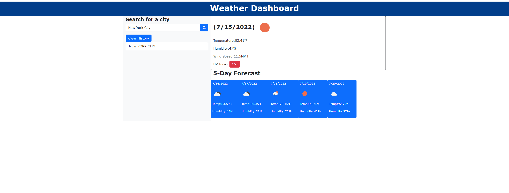

# Weather-Dashboard
Weather Dashboard for Module 6

###Description
This Weather dashboard is a web app to find the weather of any given city for both the current weather and its next 5-Day forecast. The server-side API used for this was the given Open Weather API.

Link to the Weather Dashboard: [Weather-Dashboard](https://iamfalziii.github.io/Weather-Dashboard/)

